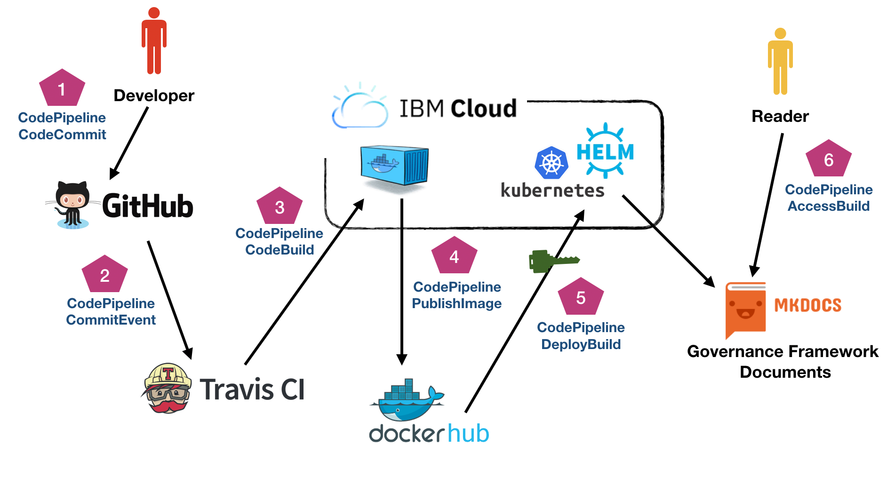
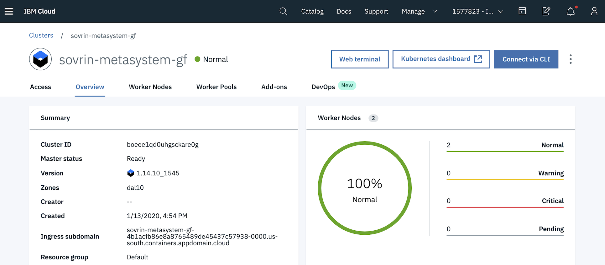

# Continuous Integration Pipeline

## Architecture



## Tools

### Kubernetes

* **Service Provider**: [IBM Cloud](https://https://cloud.ibm.com/)
* **Cluster Namespace**: ```sovrin-metasystem-gf```
* **Admin**: Decentralized Identity Development Team, IBM Security



### Helm

* **Documentation**: [Helm Charts](https://helm.sh/)
* **Process Templates**: ```./helm```

### Travis

* **Service Provider**: [Travis CI](https://travis-ci.org/)
* **Organization**: ```sovrinci```
* **Repository**: ```sovrin-foundation/SGF-v3```
* **Admin**: Lynn Bendixsen (@lynnbendixsen), Sovrin Foundation

### Docker Hub

* **Service Provider**: [DockerHub](https://hub.docker.com/)
* **Organization**: ```sovrinci```
* **Repositories**:   
    * ```sgf-v3-stm-docs```
    * ```sgf-v3-spu-docs```
    * ```sgf-v3-sbu-docs```
* **Admin**: Lynn Bendixsen (@lynnbendixsen), Sovrin Foundation

## Process

1. Developers commit code to the Sovrin Governance Framework Repository. This repo is comprised of several sub-projects, each producing a separate set of governance framework documents.
2. When a pull request is merged into the master branch of the repository, Travis CI automatically detects the changes to the repo and triggers a pipeline build.
3. Travis CI packages the code changes as well as any dependencies and builds a Docker image.
4. Travis CI pushes the Docker image DockerHub after a successful build.
5. Travis CI invokes a deployment process using Helm Charts and cluster IAM credentials to publish the Docker image in the Kubernetes namespace.
6. The pipeline process is complete and the resulting website is live to online reviewing.
7. Reviewers can assess documentation content and open issues where appropriate.

## Process Configuration

### Travis

The ```.travis.yml``` file provides the configuration settings for the *Continuous Integration Pipeline* process including build, push and deploy. A set of ```bash``` scripts are included in ```./travis``` to customize each of the CI process phases.

### Helm Templates

* ```sgfv3-deployment.yaml```: Defines the variables needed to name the docker image for a sub-project as well as access port for a launched container.

* ```sgfv3-ingress.yaml```: Defines the variables for associating the deployed public hostname for downstream ```A``` record mapping.

* ```sgfv3-svc.yaml```: Defines the port variables for the LoadBalancer.

### Helm Charts
Each sub-project (```sub```,```stm```,`spu```) defines a ```.yaml``` file that contains the variables necessary to drive the Helm Templates for the respective sub-project builds.
