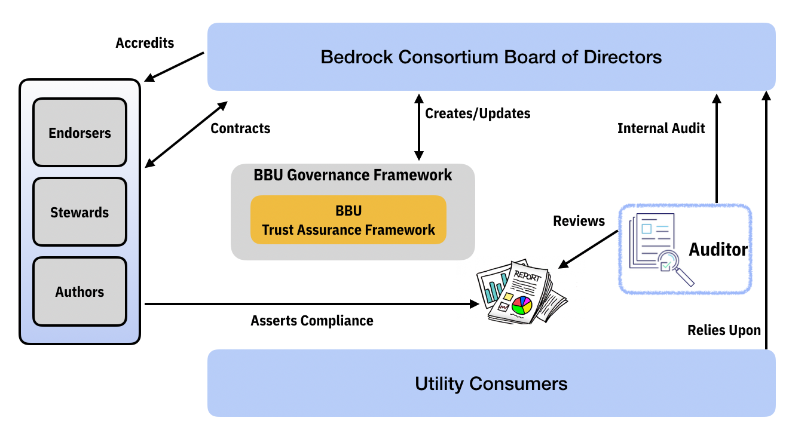

## Bedrock Trust Assurance Framework

### Introduction
The Bedrock Business Utility ("BBU") is intended to provide supporting infrastructure to maintain a sustainable permissioned identity utility that is structured as an enterprise safe-space and purpose built for trusted commerce.

Users of the BBU, namely Issuers and Verifiers of digital credentials, expect a level of assurance pertaining to the reliability and integrity of the ledger. Those users who are members of the Bedrock Consortium have a vested interest understanding the level of assurance that can be assigned to the BBU. Those users who seek public read-only access for verification purposes also desire an understanding the level of assurance to help set business verification polices but they do not have a stake in the n

### Assurance Requirements

The BBU aspires to ensure reliability, low processing latency, and a maximum uptime of the service. The Level of Assurance that can be asserted by the BBU Governance Framework will evolve over time depending on a number of factors including:

* Member Compliance
    * Adherence to technical and operating policies operating policies
    * Contract status
* Ledger Reliability
    * Probability that verification requests (ledger reads)  will operate without failure for a specified number of transactions or for a specified period of time and within an acceptable response-time.
    * Probability that transaction author requests (ledger writes) will operate without failure for a specified number of transactions or for a specified period of time and within an acceptable response-time.
* Ecosystem Trust Factor

As the BBU matures towards a production ready and actively used ledger, the degree of assurance measures that will be in place will vary.

#### Pre-Production Phase

1. No assurances for public use (read transactions).
2. Membership status will be public through Bedrock Consortium website.

#### Early Production Phase

1. No assurances for public use (read transactions).
2. Membership status will be public through Bedrock Consortium website.
2. Ledger Reliability expectations will be set and audit procedures will be established.
3. Proclamation of affiliation with the Sovrin Ecosystem will be public through the Sovrin Foundation and Bedrock Consortium websites.

#### General Production

1. No assurances for public use (read transactions).
2. Membership status will be public through Bedrock Consortium website.
2. Ledger Reliability expectations will be set and audit procedures will be established.
3. Proclamation of affiliation with the Sovrin Ecosystem will be public through the Sovrin Foundation and Bedrock Consortium websites.

### Versioning
Each version of this document is tied to the BBU Governance Framework at a specific point of time.

### Terminology
All terms in First Letter Capitals that are not defined in this document (as called out in a specific section) are defined in the [Glossary](../gf_info/glossary.md).

### Purpose
The purpose of the BBU Trust AssuranceFramework is to identify:

1. The Trust Elements that Trust Actors assert in relationship to the BBU.
2. The The BBU Roles that assert and rely upon trust.
3. Generally-Accepted, Bedrock-Specific, or Domain-Specific Trust Criteria used in the evaluation of trust associated with the BBU.
4. The Trust Assertions that BBU Roles make against Trust Criteria.
5. The Trust Evidence that Trust Actors produce to create assurance regarding their trust assertions.
6. The Trust Mechanisms in place to assert and evaluate trust.
7. The process of Trust Governance whereby trust assertions are evaluated and deemed trustworthy, so they can be relied upon by Relying Parties (BBU Consumers).

### Level of Assurance
This document describes the Level of Assurance a Relying Party can derive from the BBU Governance Framework. This section defines the maximum level.

The BBU Governance Framework claims a **maximum** level of a **reasonable** Level of Assurance.

In May 2013, the Committee of Sponsoring Organizations of the Treadway Commission (COSO)updated its [Internal Control—Integrated Framework](https://na.theiia.org/standards-guidance/topics/documents/executive_summary.pdf) (the original framework). The original framework has gained broad acceptance and is widely used around the world. It is recognized as a leading framework for designing, implementing, and conducting internal control and assessing the effectiveness of internal control. Internal control is defined as follows:

  >Internal control is a process, effected by an entity’s board of directors, management, and other personnel, designed to provide reasonable assurance regarding the achievement of objectives relating to operations, reporting, and compliance.

This definition reflects certain fundamental concepts. Internal control is:

* Geared to the achievement of objectives in one or more categories—operations, reporting, and compliance
* A process consisting of ongoing tasks and activities—a means to an end, not an end in itself
* Effected by people—not merely about policy and procedure manuals, systems, and forms, but about people and the actions they take at every level of an organization to affect internal control
* Able to provide reasonable assurance—but not absolute assurance, to an entity’s senior management and board of directors
* Adaptable to the entity structure—flexible in application for the entire entity or for a particular subsidiary, division, operating unit, or business process This definition is intentionally broad. It captures important concepts fundamental to how organizations design, implement, and conduct internal control, providing a basis for application across organizations that operate in different entity structures, industries, and geographic regions.

The [ICAEW definition of a reasonable assurance audit engagement](https://www.icaew.com/archive/technical/audit-and-assurance/assurance/process/scoping/assurance-decision/limited-assurance-vs-reasonable-assurance) is:
Where the practitioner needs to reduce the assurance engagement risk (the risk that an inappropriate conclusion is expressed when the information on the subject matter is
materially misstated) to an acceptably low level as the basis for a positive form of expression of the practitioner’s conclusion. Such risk is never reduced to nil and
therefore, there can never be absolute assurance. Per the ICAEW guidance on management of risk and liability , relying parties may perceive less than reasonable assurance based on their evaluation of the BBU Governance Framework and
the BBU Trust AssuranceFramework but not more.

### Trust Elements
The following Trust Elements guide the development of specific Trust Criteria asserted by Trust Actors in the BBU. These are based on the AICPA Trust Services Criteria based on
COSO Internal Control - Integrated Framework, for use in attestation or consulting engagements to evaluate and report on controls over information and systems (a) across an
entire entity; (b) at a subsidiary, division, or operating unit level; (c) within a function relevant to the entity's operational, reporting, or compliance objectives; or (d) for a particular type of information used by the entity.

* Security. Information and systems are protected against unauthorized access, unauthorized disclosure of information, and damage to systems that could compromise the availability,
integrity, confidentiality, and privacy of information or systems and affect the entity’s ability to meet its objectives.
* Availability. Information and systems are available for operation and used to meet the entity’s objectives.
* Processing integrity . System processing is complete, valid, accurate, timely, and authorized to meet the entity’s objectives.
* Confidentiality. Information designated as confidential is protected to meet the entity’s objectives.
* Privacy. Personal information is collected, used, retained, disclosed, and disposed to meet the entity’s objectives.

### BBU Roles Making Trust Assertions
The following BBU Roles make Trust Assertions with regard to the Trust Elements to Relying Parties within the Bedrock Community:

1. Bedrock Consortium (including the Board of Directors).
2. Steward.

### Trust Criteria
#### Bedrock-Specific Trust Criteria
For the BBU Governance Framework, the only Trust Criteria in operation are self-developed by the Bedrock Consortium and appear in section 10 and in an Addendum to that document. It comprises governance Policies the Bedrock Consortium has set for itself and the [Bedrock Member Business Policies](../gf_controlled/member_business_policies.md) and [Bedrock Member Technical Policies](../gf_controlled/member_top.md) it mandates for Stewards.

### Trust Evidence
Trust assertions are empty without evidence to support it. The following are examples of Trust Evidence that are used to support Trust Assertions for the BBU Governance Framework.

1. Signed Contracts.
2. Signed Agreements.
3. Configurations.
4. Signed Approvals.
5. Policies.
6. Procedures.
7. Logs.
    a. Security.
    b. Application.
    c. System.
    d. Database.

### Incident Records
For the BBU Governance Framework, see the Trust Assurance Matrix (Addendum) for the specific Trust Evidence used in this version of the BBU Trust AssuranceFramework.

### Trust Actors
The following is the set of Sovrin Entities who play a role in the Sovrin Governance Framework in assessing and opining on Trust Assertions in the Sovrin Network.

1. Bedrock Board of Directors. Issues the Policies within the Sovrin Governance Framework and has the right to approve and suspend Stewards from the Sovrin Network. It has the right to perform Self-Certification to evoke assurance from Relying
Parties.

2. Stewards. Agree to the Sovrin Steward Agreement and perform Self-Certification of compliance with the Steward Business Policies and Steward Technical Policies.

3. Legal Authorities. Enforce laws in the Jurisdictions of the Sovrin Foundation and Stewards and mediates the Sovrin Steward Agreement if challenged.

### Trust Mechanisms
The following are actions that the Sovrin Foundation takes to assert and assure trust:

1. Contracts and Agreements
2. Self-Assertion
    a. Sovrin Trust Criteria Compliance
    b. Legal Compliance

### Trust Governance
The following is a graphical and procedural depiction on how trust asserted from BBU Roles are currently received, assessed, and relied upon in the BBU.

For the BBU Governance Framework:

1. The Bedrock Board of Directors has established the BBU Governance Framework and this BBU Trust Assurance Framework. It has created its own Policies and those it requires of Stewards in their Role within the BBU.
2. The Bedrock Board of Directors requires members to sign the contractual instruments and perform Self-Certification that the member is compliant with the [Bedrock Member Business Policies](../gf_controlled/member_business_policies.md) and [Bedrock Member Technical Policies](../gf_controlled/member_top.md). This Self-Certification is reviewed by the responsible Bedrock Governing Body and reported to the Bedrock Board of Directors prior to approval of the Steward.

### Trust Assurance Matrix
The BBU Trust AssuranceMatrix is a tabbed spreadsheet which correlates existing Bedrock Governance Framework Policy statements across BBU Governance Framework documents and relevant stakeholders. This matrix is the foundation of self and third-party audits needed to verify compliance to the Sovrin Governance Framework.

© 2020 by Bedrock Consortium. This work is licensed under Creative Commons Attribution-ShareAlike 4.0 International License ( http://creativecommons.org/licenses/by-sa/4.0/ ).
