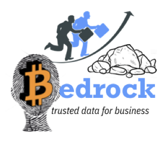

## Non-Profit Organization
The **Bedrock Consortium** ("Consortium") is a private-sector, international non-profit association of companies that share a common interest in collaborating on the governance of a dedicated trusted decentralized identity utility that can reliably serve the physical and online identity needs of international commerce. The Consortium is focused on the governance of a dedicated decentralized identity utility for trusted commerce.



### Legal Registration
The **Bedrock Consortium** is a registered *subsidiary non-profit* entity in the state of XXXXXX. It represents a formal Trust Community consisting of  participating members that adhere to the Bedrock Governance Framework (BGF). The registration of the legal entity is administered by the Sovrin Foundation, which is responsible for obtaining the necessary licenses and permits.  

### Consortium Name
Our membership shares a keen interest towards the establishment of trusted commerce. They believe in a set of fundamental privacy by design principles while mitigating financial and regulatory compliance risks.

The term ```bedrock``` carries two pertinent meanings:

1.  Gold accumulates at this solid foundational layer of the earth because water can't "wash it down" any further. The implication here is that our ledger is the bedrock for business trust worldwide.
2. A bedrock principle is one that forms the basis for others principles. Our ledger aims to provide the foundational principles for the exchange of trusted personal data.

## Board of Directors (BoD)
The Consortium will appoint a Board of Directors comprised of representatives from membership.

## Bylaws
The BoD is responsible for establishing and maintaining the governance framework for the operation and administration of the *Bedrock Business Utility ("BBU")* along with [the bylaws for the Consortium](../gf_controlled/by_laws.md).
