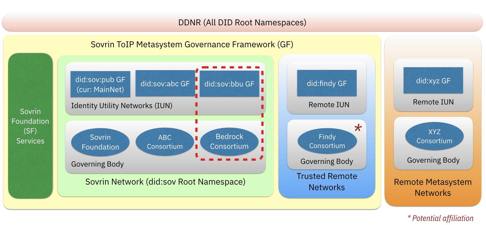

As the proliferation of decentralized identity utility networks continues to increase, the global identity industry needs a way to categorize and position independent networks for discovery, access and trust.

This is the official document of the ​Bedrock Governance Framework (BGF) which serves as the *constitution* for one such network, the *Bedrock Business Utility*.   

## Ecosystem
The [Sovrin ToIP Metasystem Governance Framework (STM-GF)]() provides the legal governance for all [Identity Utility Networks](./gf_info/glossary.md) within the Sovrin ToIP Metasystem (STM) ( "ecosystem "). Building on the notion of a network of ledgers, the STM represents an ecosystem comprised of Identity Utility Networks ("DID Ledgers") that are either part of the Sovrin DID Root Namespace (did:sov) or represented by a unique DID Root Namespace. The collection of all such Identity Utility Networks pertains to the a white-list of trusted ledgers. This white-list is referred to as the **Sovrin Ecosystem of Trust** and it is a by-product of the STM.

### Sovrin Network
There will be a variety of global ecosystems that implement the concepts outlined in the [DID Specification](https://www.w3.org/TR/did-core/). The **Sovrin Network** represents one such ecosystem where a number of [identity utility networks](./gf_info/glossary.md):

* all adhere to the STM-GF
* are all associated with the Sovrin DID Root Namespace (did:sov)
* are managed by independent governing bodies that are guided by a specific governance framework

Minimally there are two Identity Utility Networks within the Sovrin Network:

* Sovrin Public Utility (*did:sov:pub*)
* Bedrock Business Utility (*did:sov:bbu*)

### Bedrock Business Utility

The Bedrock Business Utility ("BBU") is intended to serve as a safe-zone for organizations that desire to participate in the Sovrin Ecosystem but require an enterprise grade governance framework that will:

* Enforce Permissioned Writes with contractual instruments that will ease GDPR concerns
* Establish financial sustainability of the Consortium without the use of Tokens
* Establish a governing board so no single organization owns the DID Ledger
* Require adherences to a specific stack of open standards and protocols

To meet these requirements, the BBU is an independently operated Peer-Net. A consortium of organizations operate the BBU as a public identity utility under its own governance framework. Consortium members pay annual membership fees and provide supporting infrastructure to maintain a sustainable permissioned identity utility that is structured as an enterprise safe-space and purpose built for trusted commerce. As a Peer-Net within the Sovrin Network, the consortium leverages the Sovrin Foundation as a fee-based provider for the administration and delivery of a the DID Ledger associated with the *did:sov:bbu* namespace.
