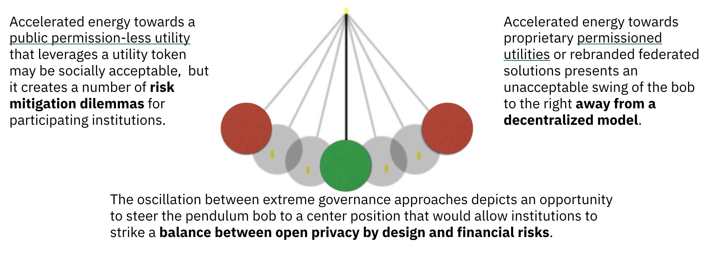

## Global Growth
Sovrin’s entry into the decentralized identity market began as a permissioned public ledger.  Over several years, it has become an industry brand associated with decentralized identity.  It represents more than an instance of a decentralized identity network based on a DLT, it is a trusted community of like-minded people and institutions from a variety of geographic regions and industry sectors. The Sovrin Community aspires to help all the entities (citizens, governments, businesses, devices) of the world to fix identity for both online and physical interactions.

During this same period, we have seen a global spotlight on privacy protection that has spawned regulation, such as GDPR and CCPA, which complements the spirit of the decentralized identity movement. However, these regulations also place additional financial risk and compliance constraints on businesses that desire to participate in and contribute to this privacy protection movement.

At the same time, the grassroots energy focused on “identity for all” has shifted or accelerated the thinking within the Sovrin Community towards a public permission-less utility that leverages a utility token. These philosophical changes, while socially acceptable, create a number of risk mitigation dilemmas for participating institutions. As a result, some businesses have exited the community while others have been hesitant to join.

Meanwhile, the hype around decentralized identity has also spawned   new federated identity systems like the [Global Association for Digital Identity (GADI)]() from the [DID Alliance]() that promote marketing messages under the banner of decentralized identity while actually establishing architectures that contradict the core Privacy by Design Principles. GADI architecture enables a collection of Digital Address Providers (DAPs) to centrally manage identities for individuals whereas the Sovrin Community advocates for an architecture that allows identities to be managed without reliance on any external administrative authority.

The Sovrin Community is comprised of minimally two disparate market segments. Both segments can agree on an Open by Design governance approach.  While the members within each market segment may require incompatible governance models, both segments adamantly disagree with any deviation from an open approach at the technology or governance levels.

To counter the pendulum bob swinging so far to the left, we have witnessed proposals for alternative proprietary solutions that reflect an unacceptable swing of the bob to the right. This oscillation between extremes depicts an opportunity to steer the pendulum bob to a center position that would allow institutions to strike a balance between open privacy by design and financial risks.  

## Transition
As the Sovrin Foundation transitions into the [Sovrin ToIP Metasystem Governance Framework (STM-GF)](), flexibility now exists for the establishment of one or more Peer-Nets that can serve the needs of the diverse segments of the Sovrin Community.

The Sovrin Business Utility is intended to address three key concerns:

1.	Policy Gridlock
2.	Permissioned Safe Zone
3.	Token-free Economics

### Policy Gridlock
The Sovrin approach for decentralized identity is to tackle it at global scale. The Sovrin Community, much like the global societies it seeks to represent, struggles with the formation of policies that can be embraced all at once by its members. The balancing of diversity goals at the operational level, risk mitigation for privacy regulation compliance, identity access for all, and the sustainability of a stable and reliable network is a non-trivial exercise. The technology adoption lifecycle teaches us that we cannot assume that all interested stakeholders will be able to embrace and adopt the technology at the same rate.

The Sovrin Foundation must find ways for it to [a] stay true to its vision; [b] aid all stakeholders on their decentralized identity journey; and [c] remain financially sustainable.
Businesses and Governments around the world must be able to balance risk mitigation and technology adoption if Sovrin desires to be an open community for all. Additionally, all stakeholders must accept the fact that a single network (DID ledger) cannot serve the entire globe. As an example, the Sovrin Network uses Hyperledger Indy, which like many consensus algorithms, carries an expected threshold of optimal validator nodes, thereby limiting the scalability of a single network.

The decentralized identity community cannot afford to have disputes at the network level. We should be focused on market creation not market bifurcation. We live in a heterogeneous world of networks where interoperability is paramount.
A single network cannot meet the needs of everyone and continued attempts to do so will minimally yield increased complexity and confusion. In fact, we have seen this within the Sovrin Foundation as it has been difficult to obtain closure after nearly a year on Version 2 of the Sovrin Governance Framework.  

The fact is that the Sovrin Foundation has been in gridlock due to apprehension between policy decisions that may be necessary for one market segment and uncomfortable for another. This concern impacts the business market segment as well as external coalitions such as FINDY and KIVA who may desire to have their own governance framework while participating in the Sovrin Community. One approach to breaking the gridlock while still enabling two market segments to co-exist is to establish a community bound to a common vision but comprised of safe-spaces for each segment to establish their own governance.

### Permissioned Safe Zone
Preventive measures for avoiding the possible insertion of personal data into an immutable ledger has been the focus of much discussion. While many have agreed that a 100% guarantee is not possible, the implementation of a public write model only increases such exposure thereby making interested stakeholders more apprehensive to embrace a permission-less governance model. A diligent effort has been made within the Sovrin Foundation to address the GDPR risks associated community stakeholders. In collaboration with legal experts, the community has established a series of contractual instruments that address these risks for each stakeholder under both the public-write and permissioned write models. Unfortunately, this effort has resulted in a greater degree of complexity to the governance framework. It has also yielded an increase in costs for Stewards that need to comply with a broader set of technical and operational requirements.

One approach to reducing the complexity of governance policies is to transition the existing Sovrin Network (DID Ledger) into a dedicated ledger for public write access and then add a new DID Ledger that would operate under a separate governance model for permissioned writes.  

### Token-free Economics
Sovrin is amidst a transition from the Sovrin Provisional Trust Framework to a new Sovrin Governance Framework that favors the use of a crypto-token to enable a payment model for public-write interactions with the ledger. The combination of public write access coupled with the conveniences of a payment token would open identity access up to a very diverse community that is currently unable to establish a trusted identity reputation.    

While the social benefits of such an approach are appealing to many, the ability for many enterprises and some governments to embrace tokens at this point in time is limiting. Once again, a compromise that will allow two market segments to co-exist is to establish a community bound to a common vision but comprised of safe-spaces for each segment to establish their own governance.

## Common Ground
The pathway to a common vision for decentralized identity is rooted in open standards and open source communities. Both market segments of the Sovrin Community can agree on an Open by Design approach.  While the members within each market segment may require incompatible governance models, both segments adamantly disagree with any deviation from an open approach at the technology or governance levels. Fundamentally, no single organization can own a network (system of ledgers) and the network must be built upon open standards and protocols where interoperability has been achieved.  
