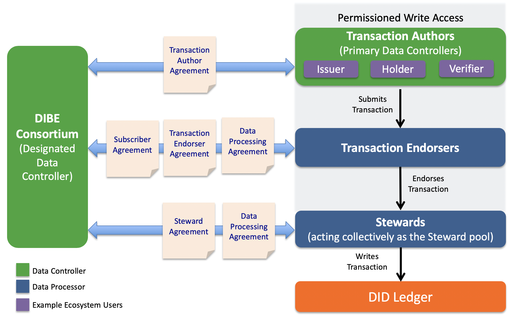
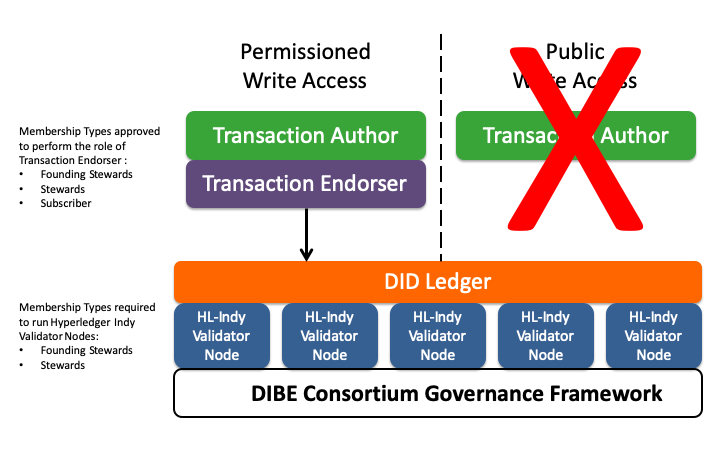
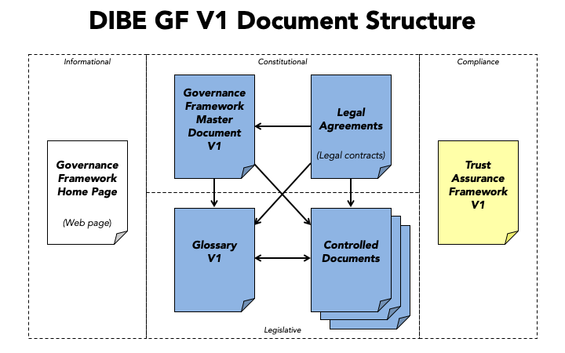

## Introduction
The Sovrin Business Utility ("Ledger") is governed by the DIBE Consortium as a dedicated public-permissioned blockchain. The nodes of this immutable ledger are hosted by a variety of businesses around the world, called Stewards. The Ledger is intended to enable Transaction Authors (see below) to publish decentralized identifiers (DIDs) and other cryptographic data structures required for the issuance and verification of digital credentials.

It is expected that the Ledger will be used primarily by businesses who have a need to issue these credentials. The credentials themselves are never written to the Ledger, so these issuers generally have no need to write data to the Ledger. This approach avoids issuers increasing risks associated with personal data under data protection regulations such as the EU General Data Protection Regulation (GDPR), the Canadian Personal Information Protection and Electronic Documents Act (PIPEDA), or the California Consumer Privacy Act (CCPA).

## GDPR Position Paper
The DIBE Consortium in conjunction with its legal counsel Perkins Coie has published a white paper providing a detailed legal analysis of the applicability of the GDPR to the Sovrin Ledger and Sovrin Network. The DIBE Consortium recognizes this work-product as prior art with applicability to any DID Ledger, especially those that are trusted within the Sovrin Metasystem. The [GDPR Position Paper](https://sovrin.org/wp-content/uploads/GDPR-Paper_V1.pdf) also assesses the data protection requirements of the higher layers (the Agent-to-Agent Protocol Layer and the Credential Exchange Layer).

## Legal Architecture
The following figure is a visual illustration of the key roles and agreements in the DIBE Consortium’s legal framework for regulatory compliance with data protection laws. Although it uses terms from the GDPR, it is intended for compliance with data protection regulations generally.

The following sections explain the actors, roles, policies, and legal agreements depicted in this diagram. Note that formal definitions for all terms that appear in First Letter Capitals are provided in the [Glossary](../gf_info/glossary.md).

## Actors & Roles

### DIBE Consortium
The DIBE Consortium is an international subsidiary non-pro{t public trust organization chartered to provide governance for the Sovrin Business Utility. The DIBE Consortium is responsible for development and
maintenance of the DIBE Governance Framework (DGF) that establishes the purpose, principles, and policies for operation of Sovrin Business Utility.

### Transaction Authors
A Transaction Author is any Organization who submits a Transaction to be written to the Ledger. As explained below, under the Permissioned Write Access policies of the DGF currently in effect, only Organizations may write Transactions. Transaction Authors may write any data type supported by the Ledger — see [What Goes On The Ledger?](../gf_controlled/ledger_data_polices.md)

### Transaction Endorsers
A Transaction Endorser is an Organization that has been approved by the DIBE Consortium to endorse Transactions on behalf of Transaction Authors. The role of Transaction Endorser is specified by the Permissioned Write Access policies of the DGF. Transaction Endorsers add their digital signature to a Transaction so it will be accepted and written by the Stewards. Under the DGF, Transaction Endorsers must acquire unlimited or limited write access to the Ledger. Transaction Endorsers must enter into both the Transaction Endorser Agreement and the Transaction Endorser Data Processing Agreement with the DIBE Consortium.

### Subscribers
Subscribers are trusted institutions who desire to participate in the Consortium as Transaction Endorsers who procure a limited number of write transaction units on an annual basis. Subscribers must enter into the Subscribers Agreement with the DIBE Consortium. Subscribers must  enter into the Transaction Endorser Agreement and the Transaction Endorser Data Processing Agreement with the DIBE Consortium.

### Stewards
Stewards are trusted institutions who operate a Node of the Ledger. Stewards must meet the qualifications specified in Member Business Policies. Stewards must enter into both the Steward Agreement and the Steward Data Processing Agreement with the DIBE Consortium. Stewards are automatically qualified to be Transaction Endorsers, however if they wish to assume that role they must separately enter into the Transaction Endorser Agreement and the Transaction Endorser Data Processing Agreement with the DIBE Consortium.

### Sovrin Ledger Access Policies

#### Permissioned Write Access
This is the set of policies that require Transaction Authors to obtain the endorsement of a Transaction Endorser in order to write a Transaction to the Ledger. There are two primary reasons for the Permissioned Write Access policy:

1. It protects the Ledger by requiring Transaction Endorsers, who have a direct contractual relationship with the DIBE Consortium to enforce the Permissioned Write Access policies, to ensure that a Transaction Author Agreement is in effect and to leverage an allocated write unit as a form of payment for a Transaction. Write Units are acquired based on Membership Type.
2. It reduces the risk of Personal Data being written to the  Ledger as that is currently prohibited under the Permissioned Write Access policies. The DIBE Consortium feels this protection is necessary under the current regulatory uncertainty regarding Personal Data on an immutable public ledger. See the [GDPR Position Paper](https://sovrin.org/wp-content/uploads/GDPR-Paper_V1.pdf) for more details.

#### Public Write Access
Under Public Write Access policies, the requirement of a Transaction Endorser signing a Transaction Authors request is eliminated; anyone would be able to write to the Ledger by following a programmatic process that aims to provide the necessary assurances against privacy compliance risks. **This form of access to the Ledger is prohibited under the DGF**.  

## Legal Document Architecture

### Primary Legal Agreements

#### Transaction Author Agreement
This is the contractual agreement between the DIBE Consortium and all Transaction Authors. It has been developed specifically to protect the right of every Transaction Author to have and hold self-sovereign identity credentials while also protecting the Ledger and the infrastructure provided by the DIBE Consortium as a global public utility. It is intended to give effect to the data protection rights of all Transaction Authors while recognizing the technical and security requirements of a public-permissioned immutable ledger. As part of the Transaction Author Agreement, every Transaction Author also agrees to be bound by the terms and conditions applicable to the Transaction Author as a controller under the Steward Data Processing Agreement and the Transaction and the Transaction Endorser Agreement to include a Data Processing Agreement. The Ledger itself is the authoritative record of all Transaction Author Agreement signatures.

#### Transaction Endorser Agreement
This is the contractual agreement between the DIBE Consortium and all Transaction Endorsers. It is simpler than the Transaction Author Agreement because the scope is limited to enforcing the Permissioned Write Access policies, including verifying that Transaction Authors have executed the Transaction Author Agreement and paying the Ledger Fee for all endorsed Transactions. The Transaction Endorser Agreement requires that the Transaction Endorser separately execute the Transaction
Endorser Data Processing Agreement and includes a current version of the Transaction Author Agreement as an Appendix.

#### Sovrin Steward Agreement
This is the contractual agreement between the DIBE Consortium and all Stewards. It covers all the rights and obligations of the DIBE Consortium and Stewards under the DIBE Governance Framework. The Steward Agreement requires that the Steward separately execute the Steward Data Processing Agreement.

### Data Processing Agreements (DPAs)
#### Transaction Endorser DPA
This is the DPA required of all Transaction Endorsers acting as Data Processors for the Transaction Author as primary Data Controller and the DIBE Consortium acting as the Designated Data Controller. It requires that the Transaction Endorser implement its own set of Technical and Organizational Measures (TOMs) that must meet or exceed the Transaction Endorser Technical and Operational Policies (TOPs) specified in the DIBE Governance Framework.

#### Steward DPA
This is the DPA required of Sovrin Stewards. It requires that the Steward implement its own TOMs that meets or exceeds the Steward TOPs.

### Technical and Operational Policies (TOPs)
#### Transaction Endorser TOPs
This is the set of policies in the DIBE Governance Framework that establish the minimum technical and organization policies and procedures that a Transaction Endorser must implement in its own Technical and Organizational Measures (TOMs) to provide adequate security, privacy, and data protection for Transaction Authors and the DIBE Consortium.

#### Steward TOPs
Similar to the Transaction Endorser TOPs, this is the set of policies in the DIBE Governance Framework that establish the minimum technical and organization policies and procedures that a Steward must implement in its own Technical and OrganizationalMeasures (TOMs) to provide adequate security, privacy, and data protection for Transaction Authors and the DIBE Consortium.
