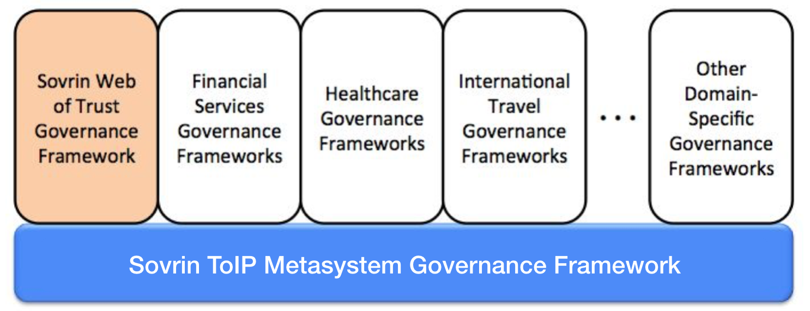
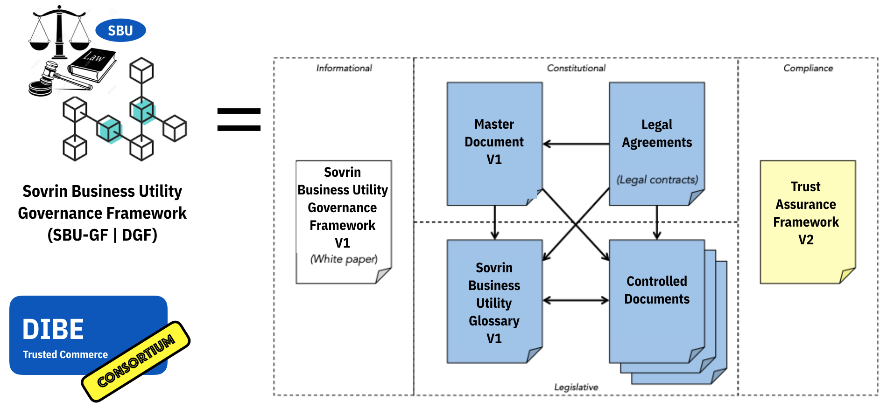

## Preface
This is an official document of the ​Sovrin Governance Framework​ V2 approved by the Sovrin Board of Trustees. If you have comments or suggestions, we invite you to contribute them to the living community version of this document​—access is open to anyone. If you are interested in joining the Sovrin Governance Framework Working Group, please visit our ​Meeting Page​.

## Acknowledgements
​This document was produced on behalf of the Board of Directors by the Governance Framework Working Group.

## Introduction
The DIBE Governance Framework (DGF) serves as the *constitution* for the *Sovrin Business Utility*. The DGF (also referred to as "SBU-GF") is a specialized Domain-Specific Governance Frameworks (DSGFs) as described in the [Sovrin ToIP Metasystem Governance Framework (STM-GF) Master Document](https://sovrin.org/wp-content/uploads/Sovrin-Governance-Framework-V2-Master-Document-V1.pdf).

The DGF leverages the principles, policies, terminology, and standards defined in the STM-GF to enable trusted digital commerce based on decentralized identity.

A key objective of the DGF is to address any concerns or risks that Consortium members may have with participation compliance with Data Protection Regulations such as the EU General Data Protection Regulation (GDPR), the California Consumer Privacy Act (CCPA), and the Canadian Personal Information Protection and Electronic Documents Act (PIPEDA).

The DGF formally consists of a set of interrelated documents that collectively forms the governance model for the Consortium and the DID Ledger (`did:sov:biz`) that the Consortium manages. The documents are organized in three (3) categories; Blue = Normative, Yellow = Assessment, White = Informative.

| Category | Name | Description |
| --- | --- | --- |
| Primary (White) | DIBE GF Whitepaper | Introduction to the DIBE Governance Framework V2 |
| Primary (Blue) | DIBE Governance Framework (DGF) Master Document | The “constitution” of the Consortium, this document defines the purpose, core principles, and core policies, and also references all other documents in the GF. |
| Primary (Blue)| DIBE Glossary | A comprehensive glossary of terms used throughout all the GF documents |
| Primary (Yellow)| DIBE Trust Assurance Framework | This document defines criteria and processes for assessing conformance of different consortium stakeholder to the policies of the DIBE Governance Framework.|
| Legal (Blue)| DIBE Founding Member Agreement | Contractual instrument between the Consortium and a Founding Member. |
| Legal (Blue)| DIBE Steward Member Agreement | Contractual instrument between the Consortium and a Steward Member. |
| Legal (Blue)| Trust Anchor Agreement |Contractual instrument between the Consortium and any person or organization initiating a write transaction to the Identity Utility Ledger.|
| Controlled Documents (Blue)| Governing Body Policies | The governance policies that apply to all DIBE Governing Bodies.|
| Controlled Documents (Blue)| Ledger Access Policies | Governing policies for reading and writing to all DIBE Ledgers and the processing of SBU transactional data. |
| Controlled Documents (Blue)| Member Business Policies |Governing qualification, application, activation, operation, suspension, and termination of Founding Members.|
| Controlled Documents (Blue)| Member Technical Policies |Governing the security, node operation, node selection, and reporting requirements for Founding Members.|
|Controlled Documents (Blue)| Economic Policies |Governing economic incentives, fees, and regulatory compliance and budgetary management.|
|Controlled Documents (Blue)| DIBE Certification Mark Policies |Governing the establishment of and use of the DIBE Certification policies for ecosystem stakeholders. |

## Purpose
The purpose of the Sovrin Business Utility is to provide a decentralized global public utility for trusted commerce. It is one of many possible DID Ledgers ("Peer-Nets").

The purpose of the DIBE Governance Framework (DGF) is to define the business, legal, and technical policies for the Sovrin Business Utility.

The purpose of the DIBE Consortium is to administer decentralized governance for Sovrin Business Utility.

## Core Principles
Unless otherwise noted, the DIBE Governance Framework (DGF) is aligned with the principles outlined in the [STM-GF Master Document]().

## Core Polices
In keeping with all Core Principles and especially the Decentralization by Design and Security by Design principles:

1. Policies, practices, procedures, and algorithms governing participation of Stewards and operation of Nodes MUST follow all Core Principles.
2. The Consortium MUST publish the following Controlled Documents managed as specified by DIBE Governing Bodies:​
a. Member Business Policies
b. Member Technical Policies​
c. Ledger Access Policies

###​ Guardianship
In keeping with the Guardianship principle, a Guardian SHOULD:

1. Act in the Dependent person’s best interest.
2. Exercise good judgment and carefully manage responsibilities.
3. Avoid commingling—keep Dependent’s property separate (e.g., separate DIDs, Public
Keys, Wallets, Vaults, etc.).
4. Keep detailed records of all actions taken on behalf of the Dependent.
5. Not violate the Anti-Impersonation principle (section 2.11.5).
6. Be subject to applicable legal structures regarding the granting and revocation of Guardianships.
​
### Inclusion
In keeping with the Inclusive by Design principles but in recognition of the permissioned write structure of the Sovrin Business Utility:

1. Read access to the Sovrin Business Utility MUST be open to all types of entities.  
2. Write access will be limited to members in good standing within the consortium.

### Trust Assurance
In keeping with all Core Principles and especially the Decentralization by Design principles:

1. The Consortium MUST specify policies, practices, and procedures for assessing conformance to the DIBE Governance Framework by publishing and maintaining the DIBE Trust Assurance Framework​ ​as a Controlled Document managed as specified by Sovrin Governing Bodies​. The Controlled Document may leverage the services and guidance of the Sovrin Trust Assurance Framework​.
2. The DIBE Consortium MUST publish the DIBE Trust Mark Policies​ ​as a Controlled Document managed as specified by DIBE Governing Bodies.​ The Consortium may decide to leverage instead the Trust Mark Policies but a DIBE Controlled Document must specify such a decision/policy.
3. An Entity serving in one of the Sovrin Network who meets the requirements in the DIBE Trust Assurance Framework MAY use the appropriate DIBE Trust Mark as specified in DIBE Trust Mark Policies​.

## Economics
In keeping with the Sustainability principle:

1. The Consortium  MUST publish the ​DIBE Economic Policies​ ​as a Controlled Document managed as specified by DIBE Governing Bodies​ in conjunction with Consortium legal counsel.
2. The Consortium MUST manage Ledger Fees and any mechanism used for paying them to ensure economic viability and sustainability for the Consortium to keep with its charter as a non-profit public trust organization.
3. The Consortium MUST retain a qualified Auditor to publish an annual public audit of Consortium finances.

## Governance
The DIBE Governance Framework Master Document and the Controlled Documents listed in Appendix A shall be revised from time to time. The policies in this section govern this process.

Unless otherwise noted, the DIBE Governance Framework (DGF) will adhere to the same procedures for managing document lifecycles as outlined in Section 4 of the [STM-GF Master Document]().

All DIBE Governance Framework documents will reside in a Github source control repository and will use the repo's Issue Tracker for change management.

## Appendix A: Controlled Documents
The following Controlled Documents are normative components of the DIBE Governance Framework V1. All framework documents are published by the Consortium in two forms:

1. A static PDF document representing the current approved version.  A link is always available via the ​Github repo and the table below.
2. A sub-section of the [Sovrin](http://sovrin.org) website so that all documentation is easily navigated.  

### Issues / Comments
A Github source control repository and will use the repo's Issue Tracker for change management.

### Definitions

| Document Name | Description | Governed By | Normative Location |
| --- | --- | --- | --- |
| SBU Glossary | Definitions of all terms used in the DGF | Governance Framework Working Group | [Approved PDF Version]() |
| Governing Bodies | Definitions of governing bodies within the Consortium | DIBE Board of Directors | [Approved PDF Version]()|
| Ledger Transaction Data|  Defines the data and metadata process by a Steward Node | Technical Governance Board | [Approved PDF Version]()|

### Specifications

| Document Name | Description | Governed By | Normative Location |
| --- | --- | --- | --- |
| Decentralized Identifiers 0.11 | Specification for DIDs and DID documents | W3C Credentials Community Group | https://w3c-ccg.github.io/did-spec/ |
| Sovrin DID Method 1.0 Specification | Specification for DIDs on the Sovrin Ledger or Sovrin Microledgers |  Sovrin Technical Governance Board | https://github.com/sovrin-foundation/sovrin/blob/master/spec/did-method-spec-template.html |
| Verifiable Credentials Data Model 1.0 | Specification for verifiable credentials | W3C Verifiable Claims Working Group |   https://w3c.github.io/vc-data-model/ |

### Policies

| Document Name | Description | Governed By | Normative Location |
| --- | --- | --- | --- |
| Governing Body Policies | Chartering and functioning of DIBE Governing Bodies | Board of Directors | [Approved PDF Version]() |
| Ledger Access Policies | Read and write access to the Sovrin Business Utility | Governance Framework Working Group | [Approved PDF Version]() |
|  Member Business Policies | Member qualification, enrollment, and operational status | Membership Committee | [Approved PDF Version]() |
| Membership Technical Policies | Technical requirements for operating and protecting a components of the SBU infrastructure. |  Technical Governance Board | [Approved PDF Version]() |
| Economic Policies | Budgetary policies for the SBU. | Finance Committee |[Approved PDF Version]() |
| Trust Mark Policies |Acceptable uses of the DIBE Trust Mark| Governance Framework Working Group | [Approved PDF Version]() |

### Frameworks
| Document Name | Description | Governed By | Normative Location |
| --- | --- | --- | --- |
| Trust Assurance Framework | Trust assurance for DGF actors |  Governance Framework Working Group |[Approved PDF Version]() |
